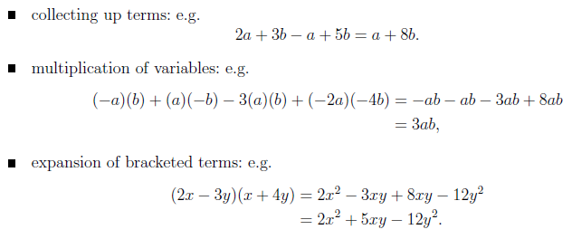

```{r,echo=FALSE,message=FALSE}
library(Ryacas)
```



###

### Simplify()

```{r}
f = yacas('-a*b + a*-b - 3*a*b + (-2*a)*(-4*b)')
PrettyForm(f)
f_sim = yacas(Simplify(f)) # must add yacas or else would just add the word Simplify before the expression
PrettyForm(f_sim)
```

###

### Expand()

```{r}
f = yacas('(2*x-3*y)*(x+4*y)')
PrettyForm(f)
f_expand = yacas(Expand(f))
PrettyForm(f_expand)
```

