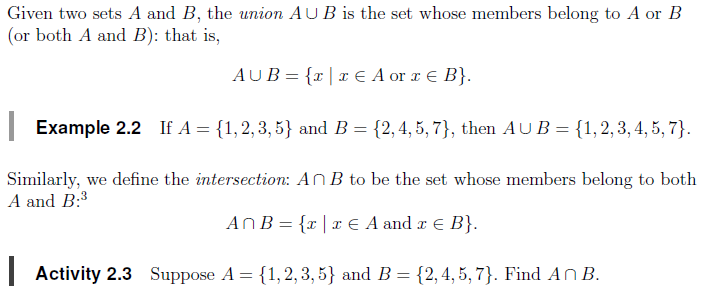

### Basic examples of Set Operations in R

```{r}
x <- c(sort(sample(1:20, 9)), NA)
y <- c(sort(sample(3:23, 7)), NA)
x
y
union(x, y)
intersect(x, y)
setdiff(x, y)
setdiff(y, x)
setequal(x, y)
```

###

### Sample questions



```{r}
# Example 2.2
A = c(1,2,3,5)
B = c(2,4,5,7)
union(A,B)
# Activity 2.3
intersect(A,B)
```