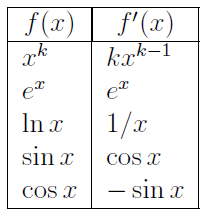

###

```{r,message=FALSE}
library(Ryacas)
library(mosaic)
```

### x^k

```{r}
x = Sym('x')
k = Sym('k')
deriv(x^k,x)
```

```{r}
plotFun(x^3~x)
deriv(x^3,x)
plotFun(3 * x^2~x, add = T)
```

### exp(x)

```{r}
deriv(exp(x),x)
```

### logb(x)

```{r}
deriv(logb(x,base = exp(1)),x)
```

```{r}
plotFun(logb(x,base = exp(1))~x)
plotFun(1/x~x)
```

### sin(x)

```{r}
deriv(sin(x),x)
```

```{r}
plotFun(sin(x)~x,xlim=c(-3.14,3.14))
plotFun(cos(x)~x,add=T)
```

### cos(x)

```{r}
deriv(cos(x),x)
```

```{r}
plotFun(cos(x)~x,xlim=c(-3.14,3.14))
plotFun(-sin(x)~x,add=T)
```

#### note that for trigonometrical function it tends to shift leftward for both sin and cos derivatives