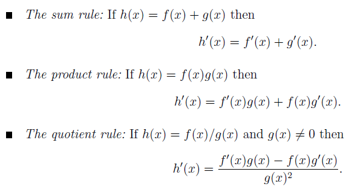
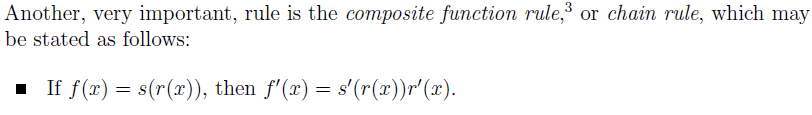
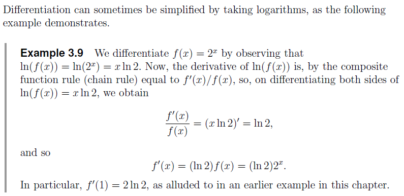

```{r,message=FALSE}
library(Ryacas)
library(mosaic)
```




Let f(x) = x^2; g(x) = x^3;  

```{r}
x = Sym('x')
f = x^2 # No yacas()
g = x^3 # No yacas()
df = deriv(f,x)
dg = deriv(g,x)
```


### Sum rule

```{r}
LHS = deriv(f+g,x)
RHS = df + dg
LHS
RHS
```

###

### Product rule

```{r}
LHS = deriv(f*g,x)
RHS = df*g + dg*f
LHS
RHS
Simplify(RHS)
```

###

### Quotient rule

```{r}
LHS = deriv(f/g,x)
RHS = (df*g-dg*f)/g^2
LHS
RHS
Simplify(LHS)
Simplify(RHS)
```

###



Suppose h(x) = f(g(x)), find h'(x)

```{r}
fx = makeFun(x^2~x)
h = fx(g)
LHS = deriv(h,x)
df
dfx = makeFun(2*x~x)
RHS = dfx(g)*dg
LHS
RHS
Simplify(RHS)
```

###

### Differentiation using log



Let f(x) = x^x  
Taking log on both sides => log(f(x)) = xlog(x)  
For the LHS, d/dx log(f(x)) == 1/(f(x)) * f'(x) (composite rule)  
For the RHS, d/dx xlog(x) == 1(log(x)) + (1/x)x == log(x) + 1 (product rule)  
=> f'(x) == f(x) * (1/x + 1) == x^x (log(x) + 1)

```{r}
deriv(x^x,x)
```

